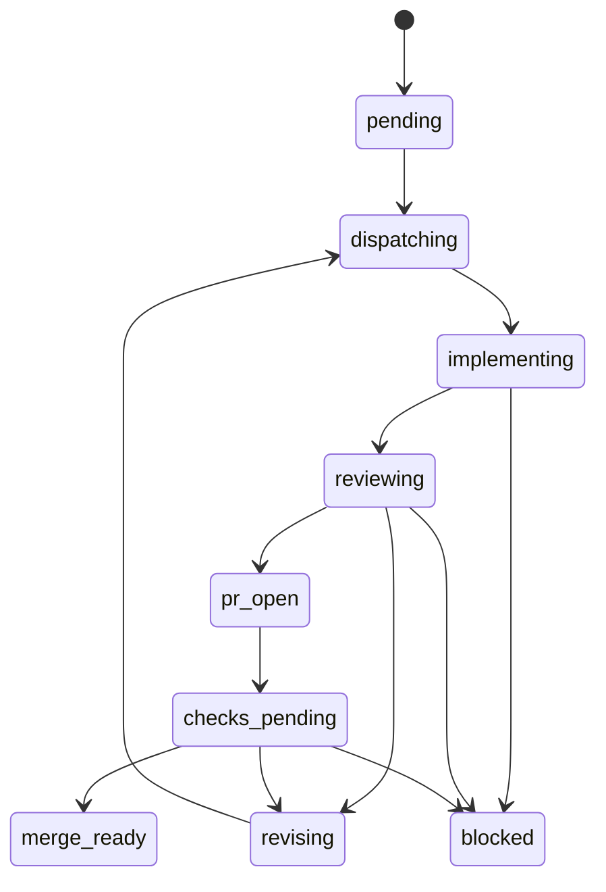

# ADR: Canonical Operator Surface for Continuous Agent Loops

## Status
Proposed, deferred to post-MVP

## Date
2026-03-06

## Related Beads
- Epic: `bd-3l12` — DX loop canonical operator surface post-MVP
- Task: `bd-3l12.1` — Document dx-loop replacement architecture and migration decision

## Context

During Prime Radiant AI V2 remediation, the founder needed a continuous loop that could:

1. dispatch a large fix wave
2. sleep for ~600 seconds
3. check real progress
4. review mid-loop state
5. re-dispatch if the work was incomplete or wrong
6. stop only when a PR was genuinely ready for human merge

The current toolchain made this much harder than it should have been.

### What happened in the V2 session

This ADR is grounded in the full back-and-forth of that session, not abstract theory.

#### Prime Radiant remediation outcomes we were trying to drive
- Wave 1 fixed the immediate V2 cockpit failures on `PR #927`.
- Wave 2 targeted the residual contract gap: true account-context top rail, default left-pane artifact stack, and stronger artifact-left/chat-right enforcement.

#### The operator experience failure
- We tried to approximate an autonomous loop with `dx-runner`, tmux, and manual review.
- The founder had to repeatedly prompt for status because the current stack did not own the loop end-to-end.
- A watcher process existing was not enough; it often had nothing meaningful left to watch.

#### Concrete failures observed

1. `dx-runner` jobs exited `success` without delivering the outcome we actually needed.
   - Example: Wave 2 `opencode` run `20260306194059-opencode-1286915` exited `exited_ok` with `reported_commit: "-"`.
   - The run mutated files in the worktree but produced no commit and no PR.
   - Current `dx-runner` semantics treated this as an acceptable terminal run state, while the actual product outcome was incomplete.

2. A background watcher can exist while the real loop is already dead.
   - Example: the tmux watcher session was still alive, but the remote `dx-runner` job had already exited.
   - That created a false sense of “continuous checking.”

3. Codex desktop can reason about the next fix, but it does not natively own persistent wake-up/stateful loop control.
   - In practice, review and re-dispatch required explicit prompting or ad hoc shell loops.

4. The founder’s cognitive model is outcome-based, not runner-based.
   - The real desired primitive is: “take these Beads items to merge-ready.”
   - The current surface exposes too many intermediate concepts: runner, batch, wave, tmux loop, manual GitHub polling.

## Current Architecture Review

### Ralph
- Files reviewed:
  - `scripts/ralph/beads-integration.sh`
  - related `scripts/ralph/*`

#### What Ralph is good at
- custom implementer/reviewer baton
- explicit revision loops
- strong notion of task progression

#### Why Ralph is the wrong answer here
- it is a bespoke older system with custom HTTP session plumbing
- it predates the current `dx-runner` governance model
- it solves agent baton flow, not modern PR/check/merge readiness
- reviving it would create a second orchestration architecture

Conclusion: do not revive or extend Ralph.

### dx-runner
- Reviewed:
  - `scripts/dx-runner`
  - `extended/dx-runner/SKILL.md`
  - `docs/adr/ADR-DX-RUNNER.md`

#### What dx-runner gets right
- single governed execution substrate
- provider adapters and preflight
- shared governance gates
- status/check/report/watchdog surfaces

#### What dx-runner does not own well enough
- PR-aware loop completion
- review/fix/re-dispatch as the core success path
- merge-ready detection
- “successful exit without commit/PR” as a hard incomplete state
- founder-grade notification semantics

Conclusion: `dx-runner` is the correct execution substrate, but not the complete operator product.

### dx-batch
- Reviewed:
  - `extended/dx-batch/SKILL.md`
  - `scripts/dx_batch.py`

#### What dx-batch gets right
- deterministic orchestration
- implement/review phases
- lease locking
- ledgers
- retry chain

#### Why dx-batch is still not the right top-level product
- it is wave-centric, not merge-ready-centric
- it does not naturally own PR creation/check polling/merge-readiness
- it still leaves the founder thinking about one extra layer of orchestration

Conclusion: useful internal orchestration logic, wrong founder-facing abstraction.

### dx-wave
- Reviewed:
  - `scripts/dx-wave`

#### What dx-wave is
- a thin profile-first wrapper

#### Why dx-wave is not enough
- it provides no meaningful loop ownership
- it increases surface area without solving the founder problem

Conclusion: remove it as a public operator interface.

## The Core Problem

The system currently lacks a canonical owner for this workflow:

1. dispatch work
2. keep checking
3. review real outcome
4. re-dispatch with fixes if needed
5. stop only at `merge_ready` or `blocked`

The gap is not model intelligence. The gap is persistent loop ownership.

An interactive agent like Codex desktop is not, by itself, a durable daemonized control plane.

## Considered Options

### Option A: Keep using shell/tmux `sleep 600` loops

#### Pros
- lowest immediate effort
- good enough for one-off overnight operations

#### Cons
- fragile and session-local
- no first-class state model
- weak notification semantics
- easy to confuse “watcher alive” with “work still progressing”

Decision: acceptable as a stopgap, not acceptable as architecture.

### Option B: Revive Ralph

#### Pros
- already has implement/review loop concepts

#### Cons
- bespoke legacy path
- not aligned to `dx-runner`
- wrong abstraction boundary

Decision: reject.

### Option C: Keep `dx-runner + dx-batch + dx-wave` as parallel public concepts

#### Pros
- avoids big migration

#### Cons
- exactly the current confusion
- too much founder/operator cognitive load
- no single canonical mental model

Decision: reject.

### Option D: Add a thin PR-aware loop wrapper while keeping three public layers

#### Pros
- smaller code change

#### Cons
- still leaves the public architecture messy
- founders still have to reason about runner vs batch vs loop

Decision: reject for the final product, though pieces of this may inform the implementation.

### Option E: Big-bang replacement with one canonical operator surface

#### Public surface
- `dx-loop`

#### Internal substrate
- `dx-runner`

#### Fate of existing tools
- `dx-batch`: absorb internal logic or deprecate from public usage
- `dx-wave`: remove as a public interface
- Ralph: historical only

Decision: accepted as the target architecture.

## Decision

Create one canonical operator-facing loop product:

- `dx-loop`

This becomes the only interface founders/operators should need for continuous agent loops.

### Public mental model

The user should think:
- “take these items to merge-ready”

The user should not have to think:
- runner
- wave
- batch
- tmux
- manual PR polling

### Internal architecture

`dx-loop` owns:
- item selection
- loop state
- dispatch/re-dispatch policy
- review/fix cycles
- PR/check state
- terminal outcome classification
- founder notifications

`dx-runner` remains the only execution/governance backend.

### Terminal states

A loop is complete only when:
- `merge_ready`
- `blocked`

It is not complete when:
- a process exits `0`
- a run mutates files without a commit
- a commit exists but no PR exists
- a PR exists but checks are still pending or failing

## Target State Machine



## Product Requirements for dx-loop

### Required behavior

1. Support one or many Beads items under one loop id.
2. Dispatch via `dx-runner`.
3. Re-dispatch if a run exits without a meaningful outcome.
4. Detect or create PRs.
5. Poll GitHub checks.
6. Dispatch fix waves when checks or review fail.
7. Notify only on action-worthy states:
   - `merge_ready`
   - `blocked`
   - `needs_decision`

### Required incomplete-state classification

The following must be first-class non-terminal outcomes:
- `exited_without_commit`
- `commit_without_pr`
- `pr_checks_pending`
- `pr_checks_failed`
- `review_revision_required`

### Required operator experience

The founder should need one command such as:

```bash
dx-loop start --items bd-a,bd-b --profile opencode-prod
```

Then the system should continue silently until:
- merge-ready
- blocked
- explicit decision needed

## Why this is deferred to post-MVP

This architecture change is important, but it is not the MVP product itself.

Immediate priority remains Prime Radiant AI V2 product correctness:
- truthful account rail
- artifact-first left pane
- chat-right contract
- real holdings
- resume and Plaid flow correctness

The DX loop redesign should not delay shipping MVP cockpit quality.

## Implementation Direction (Post-MVP)

### Big-bang, not gradual

The founder explicitly rejected a gradual transition.

So the implementation must:
- introduce `dx-loop`
- make it the canonical operator surface
- remove `dx-wave` as a public surface
- stop recommending `dx-batch` as a public operator surface
- update docs and skills in the same change

### Suggested implementation shape

#### New public entrypoints
- `scripts/dx-loop`
- `scripts/dx_loop.py`

#### New artifacts
- `/tmp/dx-loop/loops/<loop-id>/loop_state.json`
- `/tmp/dx-loop/ledgers/<loop-id>/<item>.jsonl`
- `/tmp/dx-loop/events/<loop-id>.jsonl`
- `/tmp/dx-loop/jobs/<loop-id>/...`

#### Reused internals
- provider/governance execution: `dx-runner`
- selected orchestration/lease/retry concepts from `dx_batch.py`

#### Required test coverage
- single-item merge-ready path
- multi-item parallel path
- exit-without-commit -> re-dispatch
- commit-without-pr -> PR step
- failing checks -> fix re-dispatch
- retry exhaustion -> blocked
- notify only on terminal/action-required states

## Session Evidence Summary

This decision was driven by direct operational pain, not hypothetical cleanliness:

- the founder repeatedly had to ask whether 600-second checks were actually happening
- watcher existence did not imply live progress
- Wave 2 `opencode` runs exited quickly with no commit/PR
- Codex desktop could reason about the next move but could not serve as the persistent owner of the loop without external scaffolding
- a shell `sleep 600` loop was acknowledged as feasible for one-off use, but explicitly recognized as a stopgap rather than a real architecture

## Final Recommendation

Post-MVP, implement `dx-loop` as a big-bang canonical replacement for the current founder-facing orchestration surface.

Do not:
- revive Ralph
- keep three peer public tools
- rely on tmux/manual polling as the durable answer

Do:
- keep `dx-runner` as the execution backend
- make `dx-loop` the only operator-facing loop product
- absorb or internalize the useful pieces of `dx-batch`

