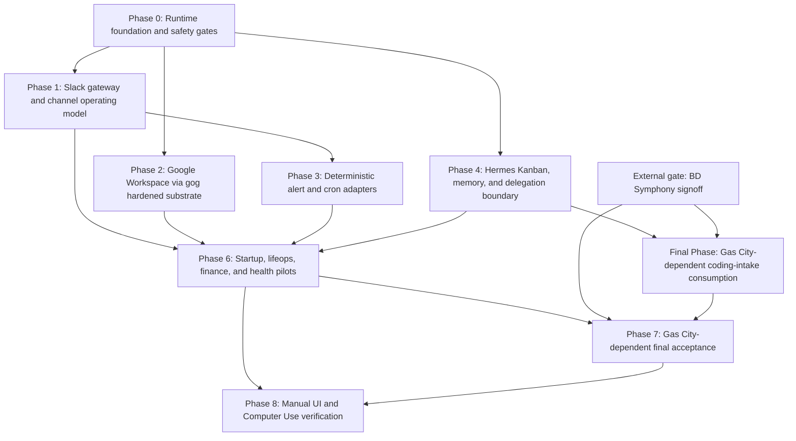

# Olivaw Hermes Implementation Epic

Feature-Key: `bd-1ocyi`

Source plan: `bd-k9rfq`, PR #620

## Summary

This is the executable implementation epic for bringing Olivaw/Hermes into the
Star's End operating stack.

The active contract is:

- Olivaw is the Slack-facing Hermes operator on `macmini`.
- Beads/Dolt remains the canonical engineering ledger.
- The BD Symphony agent owns all Gas City, BD Symphony, `dx-runner`,
  `dx-review`, `dx-loop`, and dx-* primitive/config implementation.
- This Olivaw/Hermes lane consumes the BD Symphony-owned runtime contract only
  after explicit BD Symphony signoff.
- Existing deterministic producers stay deterministic.
- `#railway-dev-alerts` and `#fleet-events` are alert input channels.
- `#lifeops`, `#finance`, `#coding-misc`, and `#all-stars-end` are discussion
  and digest channels.
- Google Workspace uses the Star's End business account
  `fengning@stars-end.ai`.
- Personal Gmail remains separate; personal Google Calendar may view a shared
  business calendar.
- Hermes provides the semantic/scheduling layer for Google workflows.
- `gogcli.sh` is the hardened execution substrate for Google API access.
- Hermes Kanban is an operator clipboard for intake, reminders, blocked cards,
  followups, and human-facing workflow.
- Hermes Kanban must not become an engineering task graph, runtime control
  plane, dependency system, PR tracker, or execution source of truth.

## Goals

1. Run Olivaw as a supervised Hermes gateway on `macmini`.
2. Verify Slack operation across alert and discussion channels.
3. Harden Google Workspace access through `gog` safety profiles.
4. Consume existing deterministic alerts without replacing producers.
5. Use Hermes cron, Kanban, skills, and delegation where they reduce founder
   load without creating a second engineering source of truth.
6. Route any real engineering work to existing canonical Beads identity and,
   after BD Symphony signoff, consume BD Symphony/Gas City execution artifacts.
7. Prove sensitive-data guardrails before live finance or healthcare workflows.
8. Surface Hermes-side correlation IDs, Slack/Google artifacts, and pointer
   metadata without implementing Gas City or dx-* surfaces in this lane.

## Non-Goals

- Do not replace Agent Coordination as deterministic transport.
- Do not replace Beads as durable engineering memory.
- Do not use Hermes Kanban as the canonical coding board.
- Do not use Hermes `delegate_task` or `subagent-driven-development` for coding
  implementation.
- Do not implement Gas City, BD Symphony, `dx-runner`, `dx-review`, `dx-loop`,
  or dx-* shim/config code in this lane.
- Do not start Gas City-dependent Olivaw behavior until the BD Symphony agent
  provides explicit signoff and a consumer contract.
- Do not expose the Hermes dashboard or API on `0.0.0.0`.
- Do not connect personal Gmail.
- Do not allow Gmail send/delete/admin/sharing actions in the first cut.
- Do not auto-submit healthcare claims or initiate Mercury banking actions.

## Active Architecture

## Phase Contract

| Phase | Beads ID | Outcome | Done proof |
| --- | --- | --- | --- |
| 0 | `bd-1ocyi.1` | Runtime foundation and safety gates | Supervisor runs, Olivaw profile loads, secrets resolve safely, dashboard/API locality is locked, first correlation path exists |
| 1 | `bd-1ocyi.2` | Slack gateway and channel model | Olivaw responds in Slack, alert channels use threads, discussion channels use digest/discussion behavior |
| 2 | `bd-1ocyi.3` | Google Workspace via `gog` | Business account OAuth works, safety profiles block send/delete/admin/sharing, smoke tests pass |
| 3 | `bd-1ocyi.4` | Deterministic alert and cron adapters | Existing alert surfaces are consumed, `[SILENT]` no-change behavior is verified |
| 4 | `bd-1ocyi.5` | Kanban/memory/delegation boundary | Hermes Kanban is operator clipboard only, Beads/Gas City stay canonical for engineering, prohibited delegation paths are blocked |
| 5 | `bd-1ocyi.6` | Final Gas City-dependent coding-intake consumption | Blocked until BD Symphony signoff; Hermes only consumes owner-provided contracts and never implements Gas City/dx-* |
| 6 | `bd-1ocyi.7` | Startup/lifeops/finance/health pilots | Non-coding, non-GasCity workflows pass smoke tests and sensitive-data guardrail tests |
| 7 | `bd-1ocyi.8` | Final Gas City-dependent acceptance | Blocked until BD Symphony signoff; Olivaw verifies visibility of owner-provided artifacts only |
| 8 | `bd-1ocyi.9` | Manual UI and Computer Use verification | Local Slack, Google, Kanban, and later Gas City-backed surfaces are verified with evidence and redaction notes |

## Beads Structure

Epic:

- `bd-1ocyi` - Olivaw Hermes implementation rollout

Children:

- `bd-1ocyi.1` - Phase 0: runtime foundation and safety gates
- `bd-1ocyi.2` - Phase 1: Slack gateway and channel operating model
- `bd-1ocyi.3` - Phase 2: Google Workspace via gog hardened substrate
- `bd-1ocyi.4` - Phase 3: deterministic alert and cron adapters
- `bd-1ocyi.5` - Phase 4: Hermes Kanban, memory, and delegation boundary
- `bd-1ocyi.6` - Final phase: Gas City-dependent coding-intake consumption
- `bd-1ocyi.7` - Phase 6: startup, lifeops, finance, and health pilots
- `bd-1ocyi.8` - Final phase: Gas City-dependent acceptance hardening
- `bd-1ocyi.9` - Phase 8: manual UI and Computer Use verification

Blocking edges:

- `bd-1ocyi.1` blocks `bd-1ocyi.2`
- `bd-1ocyi.1` blocks `bd-1ocyi.3`
- `bd-1ocyi.1` blocks `bd-1ocyi.5`
- `bd-1ocyi.2` blocks `bd-1ocyi.4`
- `bd-1ocyi.6.3` blocks `bd-1ocyi.6` until BD Symphony signoff
- `bd-1ocyi.2` blocks `bd-1ocyi.7`
- `bd-1ocyi.3` blocks `bd-1ocyi.7`
- `bd-1ocyi.4` blocks `bd-1ocyi.7`
- `bd-1ocyi.5` blocks `bd-1ocyi.7`
- `bd-1ocyi.7` blocks `bd-1ocyi.8`
- `bd-1ocyi.6` blocks `bd-1ocyi.8`
- `bd-1ocyi.7` blocks `bd-1ocyi.9`
- `bd-1ocyi.8` blocks `bd-1ocyi.9`

Related planning epic:

- `bd-k9rfq` - Hermes maximal integration program for Star's End workflows

## Implementation Details

### Phase 0 - Runtime foundation and safety gates

Deliverables:

- macmini LaunchAgent or equivalent supervised runtime for Olivaw/Hermes.
- Hermes model/provider set to the DeepSeek V4 path approved for Olivaw.
- Profile and token boundary document for `olivaw`, `coder`, `family`, and
  `finance`.
- Agent-safe 1Password secret resolution path for Slack and model secrets.
- Dashboard/API bind policy: localhost only or disabled.
- Structured observability fields:
  - `correlation_id`
  - `profile`
  - `source_surface`
  - `target_host`
  - `beads_id`
  - `repo`
  - `worktree`
  - `tool_surface`
  - `artifact_refs`
  - `status`
  - `failure_reason`

Tests:

- `hermes doctor` or equivalent runtime health check passes.
- Supervisor check proves Olivaw process is running.
- Slack and model secrets resolve through approved helpers without printing
  values.
- Dashboard/API cannot be reached from non-local interfaces.
- A dummy workflow emits one traceable `correlation_id`.

### Phase 1 - Slack gateway and channel operating model

Deliverables:

- Olivaw Slack gateway works in Socket Mode.
- Channel policy:
  - `#railway-dev-alerts`: alert input, in-thread summaries only
  - `#fleet-events`: alert input, in-thread summaries only
  - `#lifeops`: discussion and daily/life admin digests
  - `#finance`: discussion and finance/admin digests with sensitive-data rules
  - `#coding-misc`: coding intake and engineering discussion
  - `#all-stars-end`: team-wide summaries and high-level status
- Private-channel scope warning resolved or explicitly accepted as nonblocking.

Tests:

- Send a DM, an app mention, and a channel message to Olivaw.
- Verify alert channels receive thread replies, not new noisy top-level posts.
- Verify discussion channels can host new digest threads.
- Verify no routine all-clear messages appear in alert channels.

### Phase 2 - Google Workspace via `gog`

Deliverables:

- Install and configure `gog` for `fengning@stars-end.ai`.
- Complete pre-`gog` OAuth readiness:
  - create or select a Google Cloud project for Olivaw
  - configure the OAuth consent screen
  - enable required APIs in the same project that owns the OAuth client:
    - Gmail API
    - Google Calendar API
    - Google Drive API
    - Google Docs API
    - Google Sheets API
    - People/Contacts API
  - create a Desktop OAuth client
  - download the client JSON
  - store it in `gog` with `gog auth credentials <client_secret.json>`
  - run `gog auth add fengning@stars-end.ai --services gmail,calendar,drive,docs,sheets,contacts`
  - run `gog auth doctor --check`
- Create at least two execution profiles:
  - read-only profile
  - agent-safe profile with draft/artifact actions but blocked send/delete/admin
- Expose Google actions to Hermes through a Star's End skill/wrapper.
- Keep personal Gmail out of scope.
- Share business calendar into personal Google Calendar only as a view surface.

Tests:

- `gog` can list calendar events with machine-readable output.
- `gog` can list/search business Gmail with bounded output.
- `gog` can create a draft or safe artifact if enabled.
- Google Cloud APIs are enabled in the same project as the Desktop OAuth client.
- If OAuth app is External + Testing, token-expiry risk is documented; publish
  the app when long-lived refresh tokens are required.
- Gmail send is blocked.
- Gmail delete is blocked.
- Drive sharing/admin actions are blocked.
- Personal Gmail is not reachable from the Olivaw profile.

### Phase 3 - Deterministic alert and cron adapters

Deliverables:

- Existing producers remain canonical:
  - EODHD/Railway summaries from `#railway-dev-alerts`
  - dx-workflow and canonical VM status from `#fleet-events`
- Hermes consumes alert messages or deterministic artifacts through explicit
  adapters.
- Cron jobs use script-only/no-LLM mode where mechanical checks are enough.
- Cron jobs use `[SILENT]` for no-change outcomes.

Tests:

- Simulated `#railway-dev-alerts` alert produces one threaded Hermes summary.
- Simulated `#fleet-events` status update produces one threaded Hermes summary.
- No-change cron exits silently.
- Failure cron emits a correlation ID and an artifact reference.

### Phase 4 - Hermes Kanban, memory, and delegation boundary

Deliverables:

- Hermes Kanban is allowed for macmini-local, Hermes-native operations:
  - lifeops
  - research digests
  - Google Workspace follow-up
  - watchdog summaries
  - human-in-the-loop non-coding tasks
- Beads/Gas City remain canonical for:
  - coding
  - cross-VM execution
  - PR/review loops
  - worktree/Feature-Key state
  - durable engineering memory
- Unidirectional pointer rule:
  - Kanban task blocks on code.
  - Existing canonical `source_bdx` is required before the card represents real
    engineering work.
  - Missing `source_bdx` keeps the card as intake/reminder only.
  - Result links from canonical Beads/Gas City surfaces can be posted back to
    Kanban/Slack after the owning system produces them.
- `delegate_task` is allowed only for short read-only reasoning.
- `subagent-driven-development` is explicitly blocked for coding work.

Tests:

- Kanban task can be created, blocked, unblocked, and completed.
- Kanban task requiring code produces a Beads handoff rather than repo writes.
- Attempted coding delegation through prohibited path fails closed.
- Cross-profile visibility and board boundaries are documented.

### Phase 5 - Final Gas City-dependent coding-intake consumption

Deliverables:

- This phase is blocked until BD Symphony agent signoff.
- Hermes-side intake requires an existing `source_bdx` before a card represents
  real engineering work.
- Cards without `source_bdx` remain intake/reminder cards and ask for canonical
  Beads routing.
- Cards with `source_bdx` may store pointer-only metadata:
  - `source_bdx`
  - `gascity_order_id`
  - `gascity_run_id`
  - `correlation_id`
  - `surface="olivaw-kanban"`
  - `canonical_url="beads://bd-..."`
  - `operator_intent="triage|launch|followup|blocked_review"`
  - `last_known_bdx_status="open|in_progress|blocked|closed"`
- `last_known_bdx_status` is display-only and stale by definition.
- Gas City order submission, dx-* shim behavior, worktree creation,
  Feature-Key enforcement, and execution state are owned by BD Symphony/Gas
  City, not this lane.

Tests:

- Synthetic policy canary passes:
  `scripts/olivaw-kanban-policy-canary.sh`.
- Missing `source_bdx` results in intake/reminder only.
- Invalid `source_bdx` fails closed.
- Native Hermes Kanban coding/worktree execution is blocked.
- After BD Symphony signoff, a valid synthetic `source_bdx` can consume the
  owner-provided Gas City contract without this lane implementing it.

### Phase 6 - Startup, lifeops, finance, and health pilots

Deliverables:

- Startup/business pilot:
  - founder brief from Gmail/Calendar/GitHub/Railway inputs
  - Google artifact output
  - Slack digest
- Lifeops pilot:
  - calendar/task/reservation draft workflow
- Finance/health pilot:
  - document triage into approved Docs/Sheets/Drive or bounded exports
  - no raw Slack payloads
  - no default Hermes memory storage for source documents

Tests:

- Founder brief completes end to end.
- Reservation workflow drafts, but does not send/call/commit without approval.
- Finance/health blocked-action tests pass.
- Slack redaction tests pass.
- Memory/log sensitive-payload tests pass.
- Artifact-routing tests pass.

### Phase 7 - Final Gas City-dependent acceptance hardening

Deliverables:

- Blocked until BD Symphony agent signoff.
- Olivaw/Hermes verifies the operator view of BD Symphony-provided artifacts:
  - Hermes profiles
  - Slack requests
  - Kanban intake links
  - canonical Beads IDs
  - Gas City order/run/event IDs supplied by BD Symphony
  - correlation IDs
- Rollback triggers:
  - Slack spam/noise
  - Google scope overreach
  - sensitive-data leak
  - failed owner-provided coding dispatch safety check
  - repeated cron false positives
- Final operator runbook.

Tests:

- One Slack to Hermes to BD Symphony-provided artifact trace can be followed
  end to end after BD Symphony signoff.
- One Google Workspace workflow can be traced without exposing secrets.
- One Kanban to Beads handoff is visible.
- One rollback scenario is exercised without data loss.
- Final acceptance checklist passes.

### Phase 8 - Manual UI and Computer Use verification

Deliverables:

- Manual verification pass using Computer Use or equivalent local UI control.
- Manual tooling friction log comparing:
  - Computer Use for local Slack, OAuth, and account-switching workflows
  - Chrome DevTools MCP for browser inspection when URL/console exposure is safe
  - `agent-browser` and Playwright as CLI/E2E fallback lanes
- Slack Mac app checks across:
  - `#railway-dev-alerts`
  - `#fleet-events`
  - `#lifeops`
  - `#finance`
  - `#coding-misc`
  - `#all-stars-end`
- Google UI checks for:
  - business Calendar visibility and personal-calendar shared view
  - business Gmail isolation from personal Gmail
  - Drive/Docs/Sheets artifact placement
- Hermes dashboard check if enabled, bound to `127.0.0.1` only.
- Evidence record per scenario:
  - channel or surface
  - timestamp
  - correlation ID
  - expected result
  - actual result
  - redaction note

Tests:

- Alert channels show threaded Hermes summaries, not top-level routine noise.
- Discussion channels can host digest threads and agent follow-up discussion.
- Google UI confirms `fengning@stars-end.ai` scope and personal Gmail exclusion.
- Dashboard/API locality is verified from the UI/browser surface when enabled.
- Screenshots or notes do not expose healthcare or finance payloads.
- Tooling notes identify which surface worked better per scenario and call out
  account-permission or sensitive-URL exposure issues.

## Global Test Matrix

| Test family | Required proof |
| --- | --- |
| Runtime | Supervisor active, Hermes health passes, model/provider accepted |
| Secrets | OP/cache helper works, no secret values printed |
| Slack | DM, app mention, alert-thread reply, discussion digest |
| Google | `gog` read/list, draft/artifact, blocked send/delete/admin/sharing |
| Cron | `[SILENT]` no-change, alert-on-change, script-only heartbeat |
| Kanban | create/block/unblock/complete, no coding source-of-truth takeover |
| Coding | Deferred to final phase; Hermes verifies `source_bdx` intake and consumes BD Symphony-owned execution artifacts after signoff |
| Sensitive data | blocked action, Slack redaction, no default memory/log source payloads |
| Observability | correlation ID across Slack, Hermes, host/tool, artifact |
| Gas City | Final phase only; visible/exportable metadata supplied by BD Symphony owner |
| Manual UI | Computer Use evidence across Slack Mac app, Google UI, and Hermes dashboard if enabled |
| Manual tooling | friction log for Computer Use, Chrome DevTools MCP, `agent-browser`, and Playwright |

## Recommended First Task

Start or resume with `bd-1ocyi.8.2` for this narrowed pass.

Reason:

- Phase 0-4 are already verified.
- The main remaining immediate risk is stale written guidance telling
  implementers to build Gas City/dx-* behavior in the Hermes lane.
- Syncing the spec first prevents future agents from crossing the ownership
  boundary while BD Symphony is still in progress.

First task success condition:

- Spec and runbooks state the BD Symphony ownership boundary.
- Hermes Kanban pointer schema and stop condition are documented.
- Non-coding pilots are separated from Gas City-dependent final work.
- `scripts/olivaw-kanban-policy-canary.sh` passes.

## Rollback

Rollback must be profile- and surface-specific:

- stop or unload the macmini supervisor
- disable Slack Socket Mode for Olivaw
- disable Hermes cron jobs
- remove or disable Google `gog` profiles
- disable Hermes Kanban dispatcher
- keep Agent Coordination, Beads, BD Symphony/Gas City, Codex Desktop, and
  OpenCode usable without Hermes

Rollback triggers:

- Hermes posts noisy all-clear messages to alert channels
- Google workflow attempts blocked send/delete/admin/sharing
- finance/health payload appears in Slack or default Hermes memory/logs
- coding dispatch bypasses Beads or worktree/Feature-Key rules
- multi-hop failure cannot be traced by correlation ID
- manual UI verification contradicts CLI or automated test results
