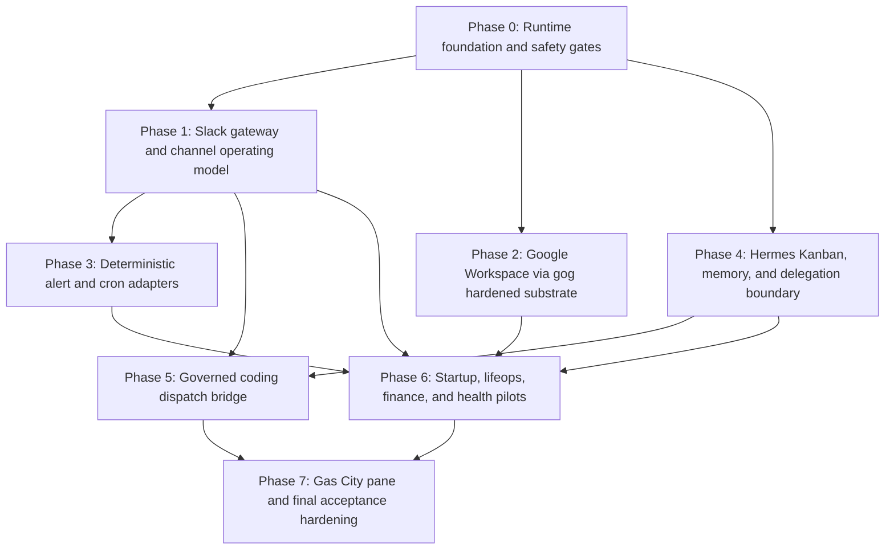

# Olivaw Hermes Implementation Epic

Feature-Key: `bd-1ocyi`

Source plan: `bd-k9rfq`, PR #620

## Summary

This is the executable implementation epic for bringing Olivaw/Hermes into the
Star's End operating stack.

The active contract is:

- Olivaw is the Slack-facing Hermes operator on `macmini`.
- `epyc12` remains the Beads/Dolt hub and primary remote coding execution host.
- Existing deterministic producers stay deterministic.
- `#railway-dev-alerts` and `#fleet-events` are alert input channels.
- `#lifeops`, `#finance`, `#coding-misc`, and `#all-stars-end` are discussion
  and digest channels.
- Google Workspace uses the Star's End business account
  `fengning@stars-end.ai`.
- Personal Gmail remains separate; personal Google Calendar may view a shared
  business calendar.
- Hermes provides the semantic/scheduling layer for Google workflows.
- `gogcli.sh` is the hardened execution substrate for Google API access.
- Beads, `dx-loop`, `dx-runner`, and Gas City remain canonical for coding and
  cross-VM orchestration.
- Hermes Kanban is allowed for macmini-local Hermes-native operations only.

## Goals

1. Run Olivaw as a supervised Hermes gateway on `macmini`.
2. Verify Slack operation across alert and discussion channels.
3. Harden Google Workspace access through `gog` safety profiles.
4. Consume existing deterministic alerts without replacing producers.
5. Use Hermes cron, Kanban, skills, and delegation where they reduce founder
   load without creating a second engineering source of truth.
6. Route all coding work through Beads plus `dx-loop` / `dx-runner`.
7. Prove sensitive-data guardrails before live finance or healthcare workflows.
8. Surface correlation IDs and run metadata for Gas City or interim observability
   artifacts.

## Non-Goals

- Do not replace Agent Coordination as deterministic transport.
- Do not replace Beads as durable engineering memory.
- Do not use Hermes Kanban as the canonical coding board.
- Do not use Hermes `delegate_task` or `subagent-driven-development` for coding
  implementation.
- Do not expose the Hermes dashboard or API on `0.0.0.0`.
- Do not connect personal Gmail.
- Do not allow Gmail send/delete/admin/sharing actions in the first cut.
- Do not auto-submit healthcare claims or initiate Mercury banking actions.

## Active Architecture

## Phase Contract

| Phase | Beads ID | Outcome | Done proof |
| --- | --- | --- | --- |
| 0 | `bd-1ocyi.1` | Runtime foundation and safety gates | Supervisor runs, Olivaw profile loads, secrets resolve safely, dashboard/API locality is locked, first correlation path exists |
| 1 | `bd-1ocyi.2` | Slack gateway and channel model | Olivaw responds in Slack, alert channels use threads, discussion channels use digest/discussion behavior |
| 2 | `bd-1ocyi.3` | Google Workspace via `gog` | Business account OAuth works, safety profiles block send/delete/admin/sharing, smoke tests pass |
| 3 | `bd-1ocyi.4` | Deterministic alert and cron adapters | Existing alert surfaces are consumed, `[SILENT]` no-change behavior is verified |
| 4 | `bd-1ocyi.5` | Kanban/memory/delegation boundary | Hermes Kanban is local-only, Beads/Gas City stay canonical for coding, prohibited delegation paths are blocked |
| 5 | `bd-1ocyi.6` | Governed coding dispatch bridge | Slack request can create/select Beads work and launch `dx-loop` or `dx-runner` with worktree and Feature-Key enforcement |
| 6 | `bd-1ocyi.7` | Startup/lifeops/finance/health pilots | Bounded workflows pass live smoke tests and sensitive-data guardrail tests |
| 7 | `bd-1ocyi.8` | Gas City pane and final acceptance | Hermes/Codex/OpenCode/Beads state is surfaced or exported with correlation IDs and rollback gates |

## Beads Structure

Epic:

- `bd-1ocyi` - Olivaw Hermes implementation rollout

Children:

- `bd-1ocyi.1` - Phase 0: runtime foundation and safety gates
- `bd-1ocyi.2` - Phase 1: Slack gateway and channel operating model
- `bd-1ocyi.3` - Phase 2: Google Workspace via gog hardened substrate
- `bd-1ocyi.4` - Phase 3: deterministic alert and cron adapters
- `bd-1ocyi.5` - Phase 4: Hermes Kanban, memory, and delegation boundary
- `bd-1ocyi.6` - Phase 5: governed coding dispatch bridge
- `bd-1ocyi.7` - Phase 6: startup, lifeops, finance, and health pilots
- `bd-1ocyi.8` - Phase 7: Gas City pane and final acceptance hardening

Blocking edges:

- `bd-1ocyi.1` blocks `bd-1ocyi.2`
- `bd-1ocyi.1` blocks `bd-1ocyi.3`
- `bd-1ocyi.1` blocks `bd-1ocyi.5`
- `bd-1ocyi.2` blocks `bd-1ocyi.4`
- `bd-1ocyi.2` blocks `bd-1ocyi.6`
- `bd-1ocyi.5` blocks `bd-1ocyi.6`
- `bd-1ocyi.2` blocks `bd-1ocyi.7`
- `bd-1ocyi.3` blocks `bd-1ocyi.7`
- `bd-1ocyi.4` blocks `bd-1ocyi.7`
- `bd-1ocyi.5` blocks `bd-1ocyi.7`
- `bd-1ocyi.6` blocks `bd-1ocyi.8`
- `bd-1ocyi.7` blocks `bd-1ocyi.8`

Related planning epic:

- `bd-k9rfq` - Hermes maximal integration program for Star's End workflows

## Implementation Details

### Phase 0 - Runtime foundation and safety gates

Deliverables:

- macmini LaunchAgent or equivalent supervised runtime for Olivaw/Hermes.
- Hermes model/provider set to the DeepSeek V4 path approved for Olivaw.
- Profile and token boundary document for `olivaw`, `coder`, `family`, and
  `finance`.
- Agent-safe 1Password secret resolution path for Slack and model secrets.
- Dashboard/API bind policy: localhost only or disabled.
- Structured observability fields:
  - `correlation_id`
  - `profile`
  - `source_surface`
  - `target_host`
  - `beads_id`
  - `repo`
  - `worktree`
  - `tool_surface`
  - `artifact_refs`
  - `status`
  - `failure_reason`

Tests:

- `hermes doctor` or equivalent runtime health check passes.
- Supervisor check proves Olivaw process is running.
- Slack and model secrets resolve through approved helpers without printing
  values.
- Dashboard/API cannot be reached from non-local interfaces.
- A dummy workflow emits one traceable `correlation_id`.

### Phase 1 - Slack gateway and channel operating model

Deliverables:

- Olivaw Slack gateway works in Socket Mode.
- Channel policy:
  - `#railway-dev-alerts`: alert input, in-thread summaries only
  - `#fleet-events`: alert input, in-thread summaries only
  - `#lifeops`: discussion and daily/life admin digests
  - `#finance`: discussion and finance/admin digests with sensitive-data rules
  - `#coding-misc`: coding intake and engineering discussion
  - `#all-stars-end`: team-wide summaries and high-level status
- Private-channel scope warning resolved or explicitly accepted as nonblocking.

Tests:

- Send a DM, an app mention, and a channel message to Olivaw.
- Verify alert channels receive thread replies, not new noisy top-level posts.
- Verify discussion channels can host new digest threads.
- Verify no routine all-clear messages appear in alert channels.

### Phase 2 - Google Workspace via `gog`

Deliverables:

- Install and configure `gog` for `fengning@stars-end.ai`.
- Create at least two execution profiles:
  - read-only profile
  - agent-safe profile with draft/artifact actions but blocked send/delete/admin
- Expose Google actions to Hermes through a Star's End skill/wrapper.
- Keep personal Gmail out of scope.
- Share business calendar into personal Google Calendar only as a view surface.

Tests:

- `gog` can list calendar events with machine-readable output.
- `gog` can list/search business Gmail with bounded output.
- `gog` can create a draft or safe artifact if enabled.
- Gmail send is blocked.
- Gmail delete is blocked.
- Drive sharing/admin actions are blocked.
- Personal Gmail is not reachable from the Olivaw profile.

### Phase 3 - Deterministic alert and cron adapters

Deliverables:

- Existing producers remain canonical:
  - EODHD/Railway summaries from `#railway-dev-alerts`
  - dx-workflow and canonical VM status from `#fleet-events`
- Hermes consumes alert messages or deterministic artifacts through explicit
  adapters.
- Cron jobs use script-only/no-LLM mode where mechanical checks are enough.
- Cron jobs use `[SILENT]` for no-change outcomes.

Tests:

- Simulated `#railway-dev-alerts` alert produces one threaded Hermes summary.
- Simulated `#fleet-events` status update produces one threaded Hermes summary.
- No-change cron exits silently.
- Failure cron emits a correlation ID and an artifact reference.

### Phase 4 - Hermes Kanban, memory, and delegation boundary

Deliverables:

- Hermes Kanban is allowed for macmini-local, Hermes-native operations:
  - lifeops
  - research digests
  - Google Workspace follow-up
  - watchdog summaries
  - human-in-the-loop non-coding tasks
- Beads/Gas City remain canonical for:
  - coding
  - cross-VM execution
  - PR/review loops
  - worktree/Feature-Key state
  - durable engineering memory
- Unidirectional bridge:
  - Kanban task blocks on code
  - Beads issue is created or selected
  - `dx-loop` or `dx-runner` executes
  - result link is posted back to Kanban/Slack
- `delegate_task` is allowed only for short read-only reasoning.
- `subagent-driven-development` is explicitly blocked for coding work.

Tests:

- Kanban task can be created, blocked, unblocked, and completed.
- Kanban task requiring code produces a Beads handoff rather than repo writes.
- Attempted coding delegation through prohibited path fails closed.
- Cross-profile visibility and board boundaries are documented.

### Phase 5 - Governed coding dispatch bridge

Deliverables:

- Slack/Hermes intake can create or select a Beads issue.
- Prompt artifacts are written with:
  - Beads ID
  - repo
  - target worktree
  - Feature-Key trailer
  - validation commands
  - return contract
- Hermes launches governed coding through:
  - `dx-loop` for chained Beads work
  - `dx-runner` for direct governed provider execution
- Raw `opencode run` or `codex exec` is restricted to approved smoke/fallback
  paths.

Tests:

- Slack request to `#coding-misc` creates/selects a Beads issue.
- `dx-worktree create <beads-id> <repo>` is used.
- `dx-loop` or `dx-runner` starts and returns run metadata.
- Missing Feature-Key fails the task.
- Pre-commit failure fails the task.
- No canonical repo writes occur.

### Phase 6 - Startup, lifeops, finance, and health pilots

Deliverables:

- Startup/business pilot:
  - founder brief from Gmail/Calendar/GitHub/Railway inputs
  - Google artifact output
  - Slack digest
- Lifeops pilot:
  - calendar/task/reservation draft workflow
- Finance/health pilot:
  - document triage into approved Docs/Sheets/Drive or bounded exports
  - no raw Slack payloads
  - no default Hermes memory storage for source documents

Tests:

- Founder brief completes end to end.
- Reservation workflow drafts, but does not send/call/commit without approval.
- Finance/health blocked-action tests pass.
- Slack redaction tests pass.
- Memory/log sensitive-payload tests pass.
- Artifact-routing tests pass.

### Phase 7 - Gas City pane and final acceptance hardening

Deliverables:

- Gas City-ready metadata for:
  - Hermes profiles
  - Slack requests
  - Beads issues
  - `dx-loop` / `dx-runner` runs
  - prompt and result artifacts
  - correlation IDs
- Rollback triggers:
  - Slack spam/noise
  - Google scope overreach
  - sensitive-data leak
  - failed coding dispatch safety check
  - repeated cron false positives
- Final operator runbook.

Tests:

- One Slack to Hermes to remote execution trace can be followed end to end.
- One Google Workspace workflow can be traced without exposing secrets.
- One Kanban to Beads handoff is visible.
- One rollback scenario is exercised without data loss.
- Final acceptance checklist passes.

## Global Test Matrix

| Test family | Required proof |
| --- | --- |
| Runtime | Supervisor active, Hermes health passes, model/provider accepted |
| Secrets | OP/cache helper works, no secret values printed |
| Slack | DM, app mention, alert-thread reply, discussion digest |
| Google | `gog` read/list, draft/artifact, blocked send/delete/admin/sharing |
| Cron | `[SILENT]` no-change, alert-on-change, script-only heartbeat |
| Kanban | create/block/unblock/complete, no coding source-of-truth takeover |
| Coding | Beads issue, worktree path, prompt artifact, `dx-loop`/`dx-runner`, Feature-Key |
| Sensitive data | blocked action, Slack redaction, no default memory/log source payloads |
| Observability | correlation ID across Slack, Hermes, host/tool, artifact |
| Gas City | visible or exportable profile/run/work metadata |

## Recommended First Task

Start with `bd-1ocyi.1`.

Reason:

- Every later phase depends on runtime, secrets, profile boundaries, local bind
  policy, and observability.
- It is the highest leverage failure surface: if Olivaw cannot run supervised on
  macmini with safe secrets and traceable logs, Slack, Google, cron, Kanban, and
  coding dispatch are all premature.

First task success condition:

- Olivaw runs supervised on macmini.
- Runtime health is verified.
- Slack/model secrets resolve safely.
- Dashboard/API exposure is locked down.
- One dummy correlation-id trace exists.
- Sensitive-data guardrail test skeleton exists.

## Rollback

Rollback must be profile- and surface-specific:

- stop or unload the macmini supervisor
- disable Slack Socket Mode for Olivaw
- disable Hermes cron jobs
- remove or disable Google `gog` profiles
- disable Hermes Kanban dispatcher
- keep Agent Coordination, Beads, `dx-loop`, `dx-runner`, Codex Desktop, and
  OpenCode usable without Hermes

Rollback triggers:

- Hermes posts noisy all-clear messages to alert channels
- Google workflow attempts blocked send/delete/admin/sharing
- finance/health payload appears in Slack or default Hermes memory/logs
- coding dispatch bypasses Beads or worktree/Feature-Key rules
- multi-hop failure cannot be traced by correlation ID
