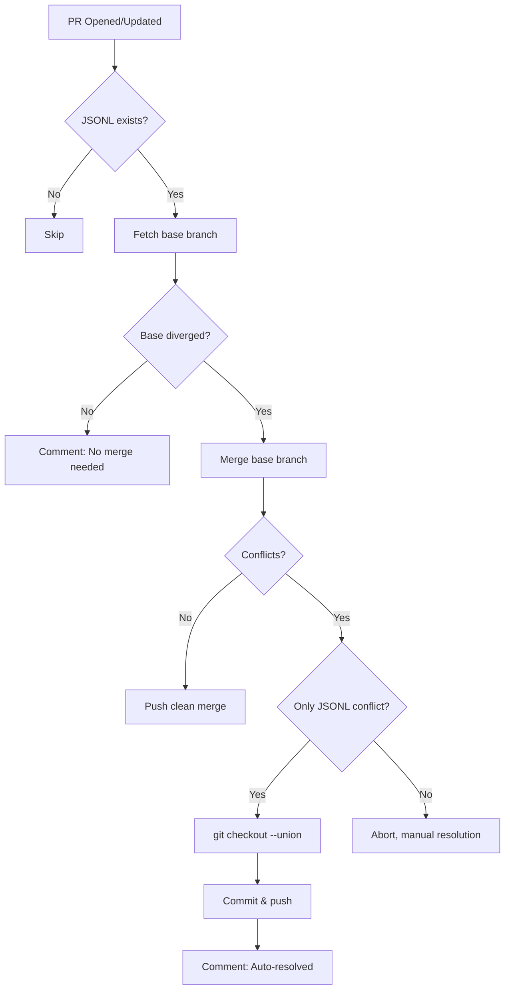

# Auto-Merge Beads JSONL Action

Composite action for automatically resolving Beads JSONL merge conflicts using union merge strategy.

## Problem

Multi-agent, multi-VM workflows cause frequent `.beads/issues.jsonl` merge conflicts when creating PRs:
- Agent 1 on VM1 adds issues A, B, C
- Agent 2 on VM2 adds issues X, Y, Z
- Both create PRs → GitHub blocks merge ("This branch has conflicts")

## Solution

Two-layer defense strategy:

### Layer 1: Proactive Prevention (Skill)
The `create-pull-request` skill merges master BEFORE creating PR:
```bash
git merge origin/master  # Union merge auto-applies
bd sync
git push
# Now create PR → No conflicts!
```

### Layer 2: Reactive Fallback (This Action)
If PR created with conflicts, this action auto-resolves:
```bash
git merge origin/master || git checkout --union .beads/issues.jsonl
bd sync --import-only
git push
# PR updated → Conflicts resolved!
```

## Usage

### Deploy to Repository

1. **Copy workflow template:**
   ```bash
   cp ~/.agent/skills/github-actions/workflows/auto-merge-beads.yml.ref \
      .github/workflows/auto-merge-beads.yml
   ```

2. **Commit and push:**
   ```bash
   git add .github/workflows/auto-merge-beads.yml
   git commit -m "feat: Add Beads JSONL auto-merge workflow"
   git push
   ```

3. **Test:**
   - Create a PR with JSONL conflicts
   - Action runs automatically
   - Check for comment: "✅ Beads JSONL Conflict Auto-Resolved"

### Use in Custom Workflow

```yaml
- name: Auto-merge Beads JSONL
  uses: stars-end/agent-skills/github-actions/actions/auto-merge-beads@main
  with:
    base-ref: ${{ github.base_ref }}
    pr-branch: ${{ github.event.pull_request.head.ref }}
    github-token: ${{ secrets.GITHUB_TOKEN }}
```

## How It Works

### Union Merge Strategy

**JSONL structure:**
```jsonl
{"id":"bd-abc","title":"Feature A",...}
{"id":"bd-xyz","title":"Feature B",...}
```

**Conflict scenario:**
```
Base:    A, B
Branch1: A, B, C
Branch2: A, B, X, Y

Union:   A, B, C, X, Y  ← Keeps all lines from both sides
```

**Why this is safe:**
- Each issue = one line
- Hash-based IDs prevent duplicates (bd-abc ≠ bd-xyz)
- Append-only structure (no line modifications)
- `bd sync --import-only` validates and imports

### Action Logic



## Inputs

| Input | Required | Description |
|-------|----------|-------------|
| `base-ref` | Yes | Base branch to merge from (e.g., `master`, `main`) |
| `pr-branch` | Yes | PR branch to merge into |
| `github-token` | Yes | GitHub token for pushing changes |

## Outputs

| Output | Description |
|--------|-------------|
| `conflict-resolved` | Whether a JSONL conflict was detected and resolved (`true`/`false`) |
| `merge-required` | Whether base branch had updates requiring merge (`true`/`false`) |

## Safety Features

### Only JSONL Conflicts
If non-JSONL files have conflicts, action aborts:
```bash
if [ "$CONFLICT_FILES" != ".beads/issues.jsonl" ]; then
  echo "❌ Multiple files have conflicts"
  git merge --abort
  exit 1
fi
```

### Validation via bd sync
After union merge, runs `bd sync --import-only`:
- Validates JSONL structure
- Imports to SQLite database
- Catches any corruption issues

### Non-blocking
Action failure doesn't block PR workflow:
- Comments on PR with status
- Manual resolution still available
- GitHub PR review continues normally

## Multi-Agent Coordination

### Scenario: 4 Agents, 4 VMs

**Without auto-merge:**
```
Agent1@VM1: Creates PR → ❌ Conflict with Agent2's changes
Agent2@VM2: Creates PR → ❌ Conflict with Agent3's changes
Agent3@VM3: Creates PR → ❌ Conflict with Agent1's changes
Agent4@VM4: Creates PR → ❌ Conflict with everyone
→ Manual resolution required for all 4 PRs
```

**With auto-merge:**
```
Agent1@VM1: Creates PR → ✅ Skill merges master first → No conflict
Agent2@VM2: Creates PR → ✅ Skill merges master first → No conflict
Agent3@VM3: Creates PR → ⚠️ Bypassed skill → Action auto-resolves
Agent4@VM4: Creates PR → ✅ Skill merges master first → No conflict
→ All PRs merge cleanly
```

## Deployment Targets

### Recommended Repos
- ✅ `prime-radiant-ai` - Primary development repo
- ✅ `affordabot` - Multi-agent coordination
- ✅ `agent-skills` - Meta-workflow repository
- ✅ Any repo with Beads tracking (`.beads/issues.jsonl`)

### Optional Repos
- ⚠️ Single-developer repos (lower conflict risk)
- ⚠️ Archived/read-only repos (no new PRs)

## Troubleshooting

### Action Not Running

**Check:**
1. Workflow file exists: `.github/workflows/auto-merge-beads.yml`
2. Action path correct: `stars-end/agent-skills/github-actions/actions/auto-merge-beads@main`
3. GitHub Actions enabled in repo settings
4. PR modifies `.beads/issues.jsonl` (workflow trigger)

**Debug:**
```bash
# Check workflow status
gh run list --workflow=auto-merge-beads.yml

# View logs
gh run view <run-id> --log
```

### Union Merge Failed

**Symptoms:**
- Action aborts with "Multiple files have conflicts"
- Comment says "Cannot auto-merge - manual resolution required"

**Solution:**
Manual resolution required (non-JSONL conflicts detected):
```bash
git merge origin/master
# Resolve conflicts manually
git commit
git push
```

### JSONL Corruption

**Symptoms:**
- `bd sync --import-only` fails
- JSONL has invalid JSON

**Solution:**
```bash
# Export clean JSONL from database
bd export -o .beads/issues.jsonl

# Or restore from git history
git show origin/master:.beads/issues.jsonl > .beads/issues.jsonl
bd import -i .beads/issues.jsonl
```

## Related Documentation

- [Beads Git Integration](https://github.com/steveyegge/beads/blob/main/docs/GIT_INTEGRATION.md)
- [Beads Multi-Repo Agents](https://github.com/steveyegge/beads/blob/main/docs/MULTI_REPO_AGENTS.md)
- [Beads Troubleshooting](https://github.com/steveyegge/beads/blob/main/docs/TROUBLESHOOTING.md)
- [create-pull-request Skill](../../skills/create-pull-request/SKILL.md)

## Version History

- **v1.0.0** (bd-p4jf): Initial implementation
  - Union merge strategy
  - Proactive skill + reactive action
  - Multi-agent safety
